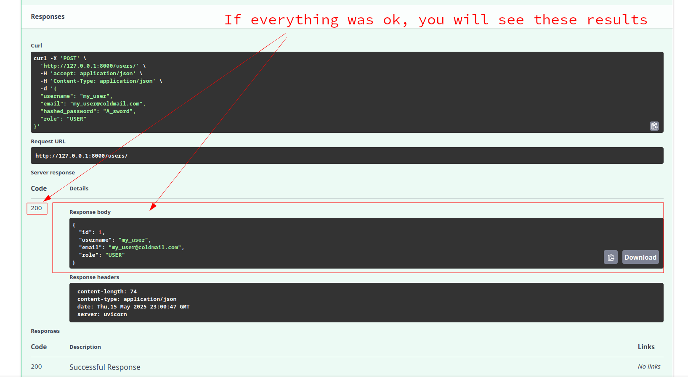
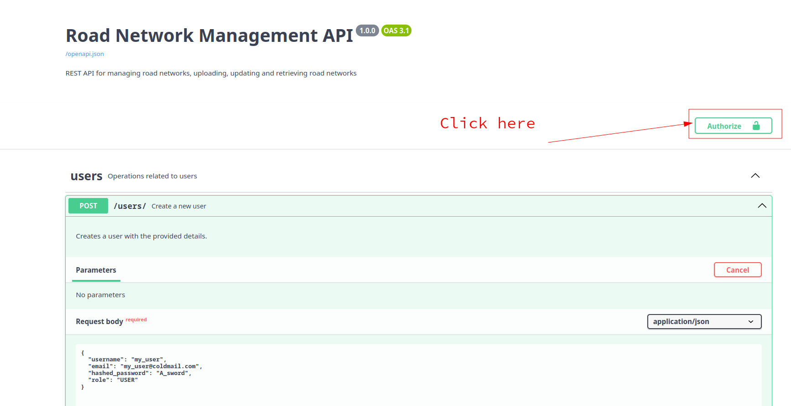
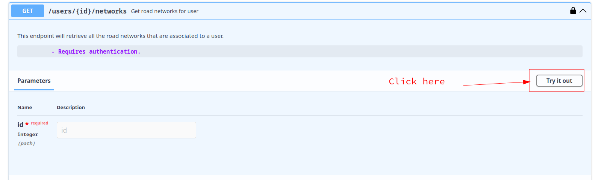

# Task - Development of REST API for management of road networks
The task is made up of three subtasks, all of which must be completed. The aim is to create a simple Rest API for managing road networks. Three example road networks (node-edge models) in GeoJSON format are attached for processing the task.


## Tasks:
### Task 1

The first two road networks should be uploaded via an endpoint and stored in a PostgreSQL database. Since the road networks essentially consist of geometries, the use of a geo-extension such as PostGIS is recommended in order to store the data efficiently. As the road networks belong to different customers, they must have a corresponding attribute to enable simple authorization.

### Task 2

The third road network is an updated version of the second network. It should be possible to perform an update via another endpoint by uploading the updated version of the network. During an update, the original edges should not be deleted, but only marked as not up-to-date.

### Task 3

The edges of the road networks should be retrievable via an additional endpoint in GeoJSON format. The endpoint should only return the edges of the specified network of an authenticated customer. It should also be possible to use a parameter to specify which point in time the network should correspond to, i.e. network 2 should be able to be retrieved in its state before and after the update.


## Specifications


1. The API framework to be used should be Flask or FastAPI, while the database is to be realized using Postgres.
2. A README.md should document the application and the approach to the task.
3. The solution must be containerized and readily executable using Docker-Compose.

---

# Getting started - Setup
**Step 1 - clone project:**
```bash
git clone git@github.com:ValantisChatzimagkas/submission-by-chrysovalantis-chatzimagkas.git
```

**Step 2 - build and run project with docker-compose:**
```
docker compose up --build
```
# Tests:

To run all tests go at the root directory and run in the terminal:
```commandline
pytest
```


**Step 3 -  check the documentation**
If everything went ok you can go to the home page at: [http://127.0.0.1:8000/](http://127.0.0.1:8000/) and there click the **Docs** link<br>
Or you can directly access them from here: [http://127.0.0.1:8000/docs](http://127.0.0.1:8000/docs)


---

# Getting started - Setup
**Step 1 - clone project:**
```bash
git clone git@github.com:ValantisChatzimagkas/submission-by-chrysovalantis-chatzimagkas.git
```

**Step 2 - build and run project with docker-compose:**
```
docker compose up --build
```

**Step 3 -  check the documentation**
If everything went ok you can go to the home page at: [http://127.0.0.1:8000/](http://127.0.0.1:8000/) and there click the **Docs** link<br>
Or you can directly access them from here: [http://127.0.0.1:8000/docs](http://127.0.0.1:8000/docs)


# Getting Started - Interacting with the API
Here we have a workflow of how one can interact with the API

**Create Account:** 
<br><br>
Click endpoint


Click on try it out


Enter your account details:


Create Account:


Scroll down and check results:


---

**Authenticate**
We must authenticate ourselves to access some of the endpoints<br>
To do so, scroll to the top of the documentation page and click here:



Fill in here your **email** and **password**


Scroll down and click here:


Exit this window:


---

**Upload a road network**
So if everything was fine so far, lets try to upload a road network.<br>
Scroll down until you see this, and click here:


Click on try it out


Click to browse and upload a road network file, it **must** be a `geojson` or a `json` 
file that contains geojson data.


Execute the road network upload


Check results:


---

**Update a road network**
Let's see the road networks our user has so that we can fetch a road network id

Click here


Click on try it out


Enter user id, since it is the first user created in our demo, it has id=1


Click to execute


Observe the results and note down the network_id, which in this case is called id


Click here


Click on try it out


Enter network id, browse file and execute the update


Observe the results


Finally, lets try the endpoint that we use to fetch a road network along with it's edges.
By now, we covered how and where to click to use an endpoint.

Enter the road network id you wish to fetch, be default if we put only the road network and not timestamp<br>
We will receive the current version of the network.<br>
If we provide a timestamp the endpoint will fetch everything from given timestamp and back in the past.


Observe the results:

